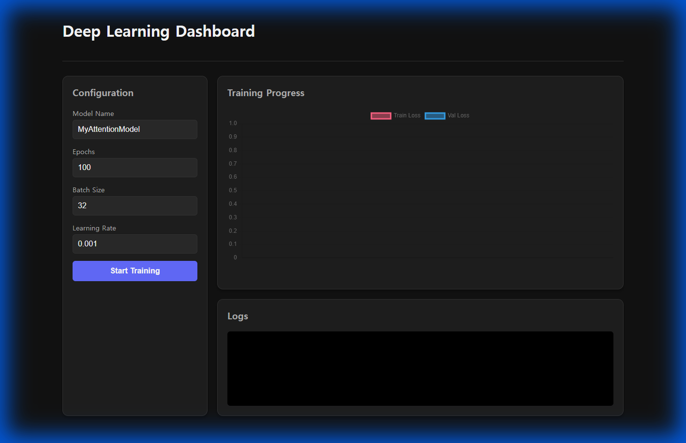

# Deep Learning Dashboard

딥러닝 모델 학습을 위한 실시간 웹 대시보드입니다. Self-Attention 기반 Transformer 모델을 브라우저에서 설정하고, GPU로 학습하며, 실시간으로 Loss 그래프를 모니터링할 수 있습니다.



## 주요 기능

### 🎯 모델 학습
- **Self-Attention 메커니즘**: Multi-Head Attention을 직접 구현한 Transformer Block 기반 분류 모델
- **GPU 가속**: CUDA를 지원하는 PyTorch로 학습 (NVIDIA GeForce RTX 3050 검증 완료)
- **실시간 모니터링**: WebSocket을 통한 Epoch 단위 실시간 Loss 업데이트

### 🖥️ 웹 인터페이스
- **설정 패널**: 모델 이름, Epochs, Batch Size, Learning Rate 조정
- **실시간 그래프**: Train Loss와 Validation Loss를 Chart.js로 시각화
- **로그 콘솔**: 학습 진행 상황을 텍스트로 실시간 출력
- **다크 모드 UI**: 현대적인 디자인과 반응형 레이아웃

## 기술 스택

### Backend
- **FastAPI**: 고성능 비동기 웹 프레임워크
- **PyTorch**: 딥러닝 모델 구현 및 학습 (CUDA 지원)
- **WebSocket**: 실시간 양방향 통신
- **UV**: Python 패키지 관리

### Frontend
- **React**: 사용자 인터페이스 라이브러리
- **Vite**: 빠른 개발 서버 및 빌드 도구
- **Chart.js**: 실시간 그래프 렌더링
- **Vanilla CSS**: 커스텀 다크 테마 스타일링

## 프로젝트 구조

```
.
├── server.py              # FastAPI 서버 및 WebSocket 엔드포인트
├── trainer.py             # Trainer 클래스 (모델 학습 로직)
├── test.py                # 독립 실행 가능한 학습 스크립트
├── check_gpu.py           # GPU 환경 확인 스크립트
├── pyproject.toml         # Python 의존성 관리 (uv)
├── uv.lock                # 의존성 잠금 파일
└── frontend/              # React 프론트엔드
    ├── src/
    │   ├── App.jsx        # 메인 컴포넌트 (폼, 차트, 로그)
    │   ├── App.css        # 스타일시트
    │   └── index.css      # 전역 스타일
    └── package.json       # Node.js 의존성
```

## 설치 및 실행

### 1. 환경 요구사항
- Python 3.11+
- Node.js 20.16+
- CUDA 지원 GPU (선택사항, CPU로도 실행 가능)

### 2. Python 환경 설정
```bash
# 가상환경 생성 (이미 생성됨)
python -m venv .venv

# 의존성 설치
.venv\Scripts\uv sync
```

### 3. Frontend 의존성 설치
```bash
cd frontend
npm install
```

### 4. 서버 실행

**터미널 1 - Backend:**
```bash
.venv\Scripts\python server.py
```
서버가 `http://localhost:8000`에서 실행됩니다.

**터미널 2 - Frontend:**
```bash
cd frontend
npm run dev
```
웹 앱이 `http://localhost:5173`에서 실행됩니다.

### 5. 브라우저 접속
브라우저에서 [http://localhost:5173](http://localhost:5173)을 열어 대시보드를 사용하세요.

## 사용 방법

1. **설정 입력**: 왼쪽 패널에서 모델 이름과 하이퍼파라미터를 입력합니다.
2. **학습 시작**: "Start Training" 버튼을 클릭합니다.
3. **모니터링**: 그래프에서 실시간으로 Loss 변화를 확인하고, 하단 로그에서 상세 정보를 확인합니다.
4. **중지**: 필요시 "Stop" 버튼으로 학습을 중단할 수 있습니다.

## GPU 확인

GPU가 정상적으로 인식되는지 확인하려면:
```bash
.venv\Scripts\python check_gpu.py
```

출력 예시:
```
Python version: 3.11.7
PyTorch version: 2.5.1+cu121
CUDA available: True
CUDA version: 12.1
Device count: 1
Current device: 0
Device name: NVIDIA GeForce RTX 3050
```

## 모델 아키텍처

### Self-Attention Transformer
- **Embedding Size**: 256
- **Layers**: 2
- **Attention Heads**: 8
- **Forward Expansion**: 4
- **Dropout**: 0.1
- **Max Sequence Length**: 100

모델은 더미 데이터로 학습되며, 실제 데이터셋으로 교체하여 사용할 수 있습니다.

## 개발 히스토리

1. **환경 설정**: Python 3.11 가상환경 및 UV 패키지 관리자 설정
2. **모델 구현**: Self-Attention 및 Transformer Block 구현
3. **백엔드 개발**: FastAPI + WebSocket 서버 구축
4. **프론트엔드 개발**: React + Chart.js 대시보드 구현
5. **UI/UX 개선**: 중앙 정렬 및 다크 모드 스타일링

## 라이선스

이 프로젝트는 교육 및 연구 목적으로 자유롭게 사용할 수 있습니다.
